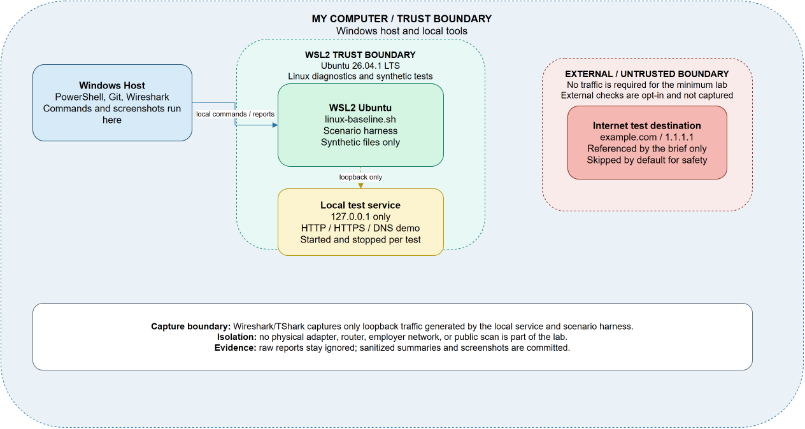

# NetTrace Support Lab

NetTrace Support Lab is a beginner-friendly Windows and Linux practice environment for diagnosing safe, intentionally created failures. It follows the same pattern used by a support technician: clarify the symptom, establish a baseline, gather evidence, make the smallest reversible change, validate the repair, and document the result.

> **Status:** Complete after the final acceptance audit recorded in [`docs/completion-report.md`](docs/completion-report.md). Raw generated evidence remains intentionally local and ignored.

The repository also includes a localhost results dashboard and a research-backed [`GOAL2.txt`](GOAL2.txt) roadmap for the next support-operations phase.

## What a beginner will learn

An **IP address** identifies an interface, a **route** chooses where packets go, a **DNS lookup** translates a name into an address, a **port** identifies a service, and a **permission** controls access to a file. The lab deliberately tests these layers separately so a learner can explain why a symptom is DNS, connectivity, a closed port, a stopped process, or a permission problem.

## Architecture



The editable diagram is [`docs/network-diagram.drawio`](docs/network-diagram.drawio), with an SVG export at [`docs/network-diagram.svg`](docs/network-diagram.svg). Windows and WSL2 are inside the local trust boundary. Test services bind to `127.0.0.1`; external destinations are shown only as an opt-in reference and are not captured by default.

## Local results dashboard

The dashboard generates status cards, environment details, five scenario results, the implementation timeline, a complete SVG connection diagram, system-design checks, validation results, and local evidence links from sanitized JSON.

Start it from the repository root:

```powershell
pwsh -NoProfile -File .\scripts\start-dashboard.ps1
```

Open `http://127.0.0.1:8765/web/`. Stop it with:

```powershell
pwsh -NoProfile -File .\scripts\stop-dashboard.ps1
```

Detailed operation and validation are documented in [`docs/dashboard.md`](docs/dashboard.md). The browser is presentation-only and cannot execute arbitrary diagnostics.

### Checking a friend's device safely

A web link cannot silently inspect another computer. The dashboard therefore provides a consent-based flow at `http://127.0.0.1:8765/web/friend-check.html`: the device owner reviews and runs [`scripts/friend-device-check.ps1`](scripts/friend-device-check.ps1), then selects the generated JSON in the page. The JSON is processed locally in the browser and is not uploaded. The checker does not store usernames, hostnames, addresses, MACs, credentials, files, DNS servers, gateways, ports, or process IDs.

## Repository identity

- **Software/lab name:** NetTrace Support Lab
- **Repository:** `Network-Troubleshooting-and-Support-Lab`
- **GitHub remote:** `https://github.com/Shine0078/Network-Troubleshooting-and-Support-Lab`
- **Default branch:** `main`
- **Local working directory:** the local checkout containing this `README.md`

## Software prerequisites

Required tools are Windows, WSL2 with Ubuntu, Windows Terminal, PowerShell, Git, VS Code, Wireshark/TShark, diagrams.net, and a GitHub account. Python is used by the local scenario harness and report generator.

The verified environment currently includes Ubuntu 26.04.1 LTS under WSL2, PowerShell 7.6.5, Git 2.53.0, VS Code 1.134.0, Python 3.13.15, Wireshark/TShark 4.6.8, diagrams.net 31.4.5, and GitHub Desktop 3.6.6. Use `py -3` if the Windows Store `python.exe` alias masks the installed interpreter.

Official sources: [Microsoft WSL installation](https://learn.microsoft.com/en-us/windows/wsl/install), [Python for Windows](https://www.python.org/getit/windows/), [Wireshark downloads](https://www.wireshark.org/download.html), [diagrams.net](https://app.diagrams.net/), and [GitHub Desktop](https://desktop.github.com/download/).

## Installation and setup

1. Install WSL2 and Ubuntu, then verify the distribution:

   ```powershell
   wsl --install --distribution Ubuntu --no-launch
   wsl -l -v
   wsl -d Ubuntu -- uname -a
   ```

2. Install the desktop tools from their official sources or with a trusted package manager. Confirm versions before using the lab.
3. Clone or add this repository in GitHub Desktop. The local repository is already connected to `main`; use `github open "<path-to-local-checkout>"` to open an existing local checkout.
4. Do not change a physical adapter, router, system DNS, or firewall rule for the minimum lab.

## Baseline scripts

The collectors write timestamped raw reports to `reports/generated/`, which is ignored by Git. Review and sanitize a report before sharing it.

Windows, local-only default:

```powershell
pwsh -NoLogo -NoProfile -ExecutionPolicy Bypass -File .\scripts\windows-baseline.ps1
```

Linux/WSL2, local-only default:

```powershell
# From Ubuntu, first change to the WSL-mounted repository root, then run:
cd /mnt/c/path/to/Network\ Troubleshooting\ and\ Support\ Lab
bash scripts/linux-baseline.sh
```

Both scripts record the operating system, timestamp, interface/route evidence, loopback test, and listening services. The project-brief checks for `1.1.1.1` and `example.com` are available only through the explicit `-IncludeInternetChecks` or `--include-internet` switch. They are skipped by default to preserve the local-only safety boundary.

Generate a redacted summary with:

```powershell
py -3 .\scripts\generate-report.py
```

## Troubleshooting method

The standard workflow is documented in [`docs/troubleshooting-method.md`](docs/troubleshooting-method.md): clarify, identify, scope, baseline, hypothesize, gather evidence, make the smallest safe change, verify, document, and escalate. [`docs/command-reference.md`](docs/command-reference.md) explains what each command can and cannot prove.

## Five controlled failures

Run all five in Ubuntu; the harness starts and stops only local services and temporary files:

```powershell
# From the WSL-mounted repository root:
python3 scripts/lab-scenarios.py
```

1. **DNS failure:** an invalid local resolver endpoint fails while a loopback HTTP service remains reachable; a temporary responder restores name resolution.
2. **Unavailable port:** a working listener is stopped, the port refuses connections, and the listener is restarted.
3. **Incorrect endpoint:** a client uses the wrong loopback port, then returns to the expected endpoint.
4. **Stopped service:** a running process is stopped, its process state is inspected, and it is restarted.
5. **Permission failure:** an unprivileged account is denied a synthetic file, permissions are restored, and content is validated.

Sanitized results are recorded in [`docs/scenario-evidence.md`](docs/scenario-evidence.md). Support-ticket versions are in [`tickets/`](tickets/).

## Testing and evidence

Static project validation:

```powershell
py -3 .\tests\validate_project.py
```

Full validation in Ubuntu, including the five scenarios:

```powershell
# From the WSL-mounted repository root:
python3 tests/validate_project.py --run-scenarios
```

The baseline scripts were each run twice with exit code `0`, reports contain timestamps, and the scenario harness returned `PASS`. Packet-analysis validation and the final acceptance checklist remain pending until the screenshots are created and reviewed.

## Wireshark and screenshots

Capture only loopback traffic generated by the local harness. The detailed method and interpretation are in [`docs/packet-analysis.md`](docs/packet-analysis.md). Use filters such as `dns`, `tcp`, `tls`, `ip.addr == 127.0.0.1`, and `tcp.port == 443`. Do not commit `.pcap` or `.pcapng` files. Reviewed screenshots are available under `screenshots/` and show DNS, TCP setup, TLS, HTTPS metadata, timing, and the limits of TLS visibility.

- [DNS request/response](screenshots/wireshark-dns.png)
- [TCP and TLS handshake](screenshots/wireshark-tcp-tls.png)
- [HTTPS metadata](screenshots/wireshark-https-metadata.png)

## Security and privacy

Read [`docs/security-boundaries.md`](docs/security-boundaries.md) and [`docs/threat-model.md`](docs/threat-model.md) before running a scenario. The `.gitignore` excludes `.env`, private keys/certificates, tokens, secrets, Terraform state, credentials, private directories, and packet captures. Raw generated reports remain local. Synthetic names and fictional warehouse data are mandatory.

The authoritative `GOAL1.txt` prompt remains in the local checkout for project control but is intentionally excluded from Git because it contains machine-specific path and hardware details.

## Cost

The minimum lab uses free Windows/WSL features and free/open-source tools. It requires no Azure, AWS, Docker, Kubernetes, paid cloud service, or production network equipment. Internet access may be needed to download software, but the lab does not require an external runtime service.

## Cleanup

The harness cleans up its temporary HTTP/DNS threads and permission-test directory. Before sharing the project:

```powershell
git status --short --branch
git check-ignore -v reports/generated/example.txt screenshots/example.pcapng
wsl -d Ubuntu -- bash -lc 'find /tmp -maxdepth 1 -type d -name "nettrace-permission-*" -print'
```

Stop any manually started local service, remove only synthetic generated data, and confirm no raw captures or reports are tracked.

## IT support and cloud-security relevance

This lab demonstrates the habits expected in IT support, help desk, application support, and junior systems roles: structured triage, clear tickets, evidence-based changes, service/port distinction, Linux and PowerShell fluency, and user-impact language. The security controls add cloud-security habits: least privilege, trust boundaries, data minimization, capture scope, reproducibility, and explicit handling of residual risk.

## Five-minute demo

Follow [`demo/demo-script.md`](demo/demo-script.md) for a timed walkthrough suitable for an interview. It covers the architecture, baselines, five failures, packet evidence, and support-ticket method.

## Implemented controls vs. future improvements

### Implemented

- Local-only Windows and Linux baseline collectors with timestamps, useful exit codes, and opt-in external checks.
- Sanitized environment documentation, command reference, workflow, security boundaries, threat model, and editable diagram.
- Repeatable localhost scenario harness with failure/recovery assertions and cleanup.
- Five support tickets and a five-minute demonstration guide.
- Git ignore rules, secret-pattern checks, static validation, and Git history.

### Future improvements

- Add a second isolated VM only if WSL2 coverage is insufficient.
- Add optional PSScriptAnalyzer and ShellCheck linting in a local CI workflow.
- Add a small local dashboard that reads only sanitized summaries.
- Add a reviewed, reproducible packet-capture fixture if a future public release needs offline analysis without live capture.

## Credits and references

The lab is original project work guided by the authoritative `GOAL1.txt` requirements. Technical references are the official Microsoft WSL, Python, Wireshark, diagrams.net, Git, and GitHub Desktop documentation linked above. No employer data, real credentials, or copied project content is used.
